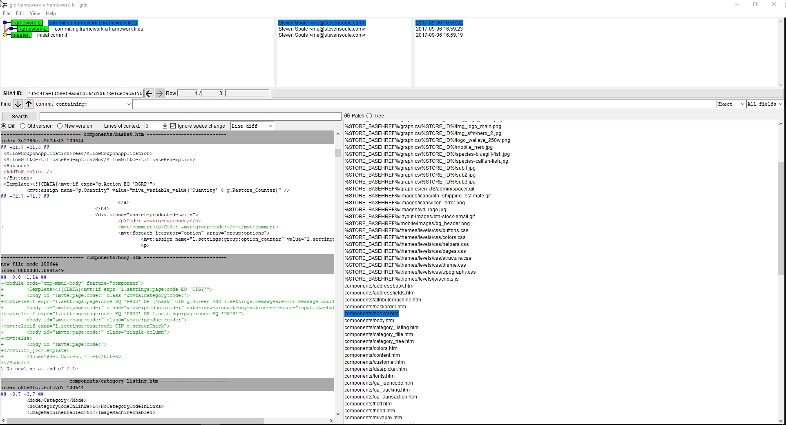

# git-diff-miva-frameworks

Shell Script to Extract two Miva .pkg framework files, create git branches out of them, and launch [gitk](https://git-scm.com/docs/gitk) for diff'ing



## Script Process

1. [Download or Save a copy of the Miva Framework .pkg files](https://docs.miva.com/videos/saving-a-framework) for the two frameworks that you want to compare.
2. Put the `compare.sh` file in the same directory as the two frameworks.
3. Open up a [git terminal](https://git-scm.com/downloads) and execute the following command:
```
sh process.sh framework-a.pkg framework-b.pkg
```
4. Wait for the process to run (It should take about 30-60 seconds.)
5. It will launch `gitk` so you can visually compare the two git branches. In `gitk` you can:
	1. Select the "framework-b" branch
	2. Then right-click on the "framework-a" branch
	3. Select, "Diff this -> selected"
	4. Thats it! Compare the differences.

## Manual Process

1. Get Miva Framework .pkg files for the two frameworks that you want to compare.
2. Rename the ".pkg" file extensions to ".tar.bz2"
3. Extract each framwork to their own directories, (ex. /framework-a/ and /framework-b/) using a extraction program (7-Zip, WinZip, etc.)
4. Create a new directory /git/
5. Create a file /git/README.md with a basic title describing the project
```
# "Example Store's" Framework Diff

Date: 2017-09-01
```
6. Your directory structure should look like this:
```
/framework-a/[framework-a's extracted files here]
/framework-b/[framework-b's extracted files here]
/git/README.md
```
7. Issue the following commands on the `master` branch `git add .`, then `git commit -m "initial commit"`
8. Create & switch to a new `framework-a` branch `git checkout -b framework-a`.
9. Copy the contents of the framework-a framework's extracted pkg/tar.bz2 folder (`/framework-a/`) into `/git/`
10. Index & commit the changes to the `framework-a` branch`. `git add .`, then `git commit -m "commiting framework-a framework files"
11. Switch back to the master branch. `git checkout master`
12. Create & switch to a new `framework-b` branch `git checkout -b framework-b`.
13. Copy the contents of the framework-bed framework's extracted pkg/tar.bz2 folder (`/framework-b/`) into `/git/`.
14. Index & commit the changes to the `framework-b` branch`. `git add .`, then `git commit -m "commiting framework-b framework files"
15. Switch back to the `master` branch.
16. Open the `/git/` directory in a git gui, like SourceTree, and compare the two branches. (Note instead of using two branches, you could use two commits).